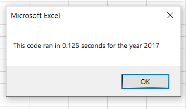
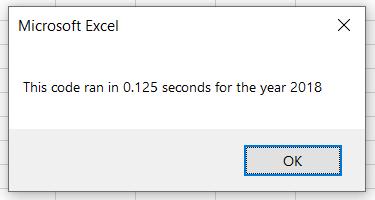

# Stock Analysis using VBA and Excel 

Please find here the link to the excel spreadsheet [*VBA Challenge*](VBA_Challenge.xlsm.zip).

## 1. Overview of Project

### Purpose
The purpose of this project was to analyze the stock data from years 2017 and 2018. The project was initiated by client "Steve" who initially asked for a data analysis on the DQ stocks only. However, seeing as there was also data regarding other stocks, the template was used to the analyse more stocks. 

The data was refactored to make the code of the initial analysis more efficient. The ultimate goal was to have the code run quicker. Hence, the timer was included in this analysis. 

## 2. Results

### Improvements to the Code 
#### Additional Index - *tickerIndex*
The *tickerIndex* was introduced to make the code more efficient by eliminating using a further variable, such as *i* which was used during the initial run. 

This index was continuously used as an index to access the stock ticker for the introduced arrays:
- *tickers*
- *tickerVolumes*
- *tickerStartingPrices*
- *tickerEndingPrices*

Using *tickerIndex* as an introduced index for these arrays, helped loop the information once using the variable *i* only, rather than having introduced a second variable *j* as was done during the first anaysis for Steve. 

#### Setting *i=0 to __RowCount__* 
Setting *i=0 to __RowCount__* had already been done in the first analysis. However doing this attribute, will make the code more efficient. 

#### *TickerVolumes* set to *Long*
The data type of *TickerVolumes* was set to *Long* to aid the data analysis in case of the raw data was too large to hold.

### Results 
Utilizing these improvements, enhaced the code, by making it more efficient and easier to read. 

#### Analysis for 2017
The code run for data set for 2017 stocks took 0.125 seconds as opposed to 0.8515625 seconds when using the not refactored code.

#### Analysis for 2018 
The code run for the 2018 data set also took 0.125 seconds as opposed to 0.8470001 seconds when using the not refractored code. 

## 3. Summary 

### Advantages and Disadvantages of Refactoring Code
#### Advantages
By far the biggest advantage of refactoring code is being able to save time when the code is run. This is especially important whent the data set that is being used, is extremely large. It saves time and runs more efficiently. 

The code also becomes easier to read and understand. This makes things escpecially simple when multiple people have access to the code. 

#### Disadvantages
A disadvantage of refactoring code is that it can be time consuming to enahnce it. It will also take a longer period of time to find and fix mistakes. 

### How these Advantages and Disadvantages apply to the original VBA script
One of the disadvantages that I found while working on refactoring the code, is that each index, specifically *trickerIndex*, had to be correctly defined in order for the code to run. With having refactored code, it was much more difficult in my opinion to find where the bug is and how to fix it so that the system would understand it. This caused a far higher time commitment to writing code than with the non-refractored script. 

There is also more room for spelling errors when using a newly introduced index, *trickerIndex*, when using it to access the stock ticker index for: *tickerVolumes*, *tickerStartingPrices*, and *tickerEndingPrices*.

Using simple indexes such as *i* or *j* was for myself simpler to understand. 
